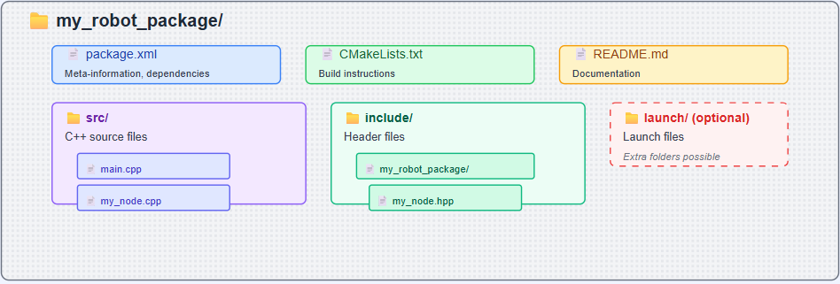

<a href="https://sonarcloud.io/summary/overall?id=Hassannawazish_turtlebot3_localization_ros2&branch=main" 
   title="Click to view SonarCloud project overview">
    
</a>

# Autonomous robot using C++ and ROS
The goal is to complete the basics of ROS2 using C++. Without using or minimal use of GPT.
The package structure is given below,



The package is created by using the command below,

$ros2 pkg create --build-type ament_cmake <package_name> --dependencies <package_dependency_1> <package_dependency_2>

```bash
source /opt/ros/humble/setup.bash
cd ~/ros2_ws/
cd src
ros2 pkg create --build-type ament_cmake package_name --dependencies rclcpp
```

For building the package,

```bash
source /opt/ros/humble/setup.bash
cd ~/ros2_ws/
colcon build
```
or you can use like that,

```bash
source /opt/ros/humble/setup.bash
cd ~/ros2_ws/
colcon build --packages-select <package_name>
```

## Client Libraries
ROS client libraries allow ROS2 scripts written in various programming languages to use ROS2. A core ROS client library (RCL) provides the standard functionality needed by various ROS APIs.

#include "rclcpp/rclcpp.hpp"

CMakeLists.txt defines how to build executables from your C++ source files.For ROS2 executables, we need three main components:
add_executable(): This creates an executable from your C++ source file.
ament_target_dependencies(): This links ROS2 dependencies to your executable.
install(): This installs the executable so it can be found by ros2 run.

```bash
add_executable(executable_name src/source_file.cpp)
ament_target_dependencies(executable_name rclcpp)
install(TARGETS executable_name DESTINATION lib/${PROJECT_NAME})
```

We also need to update your package.xml file to include the C++ dependencies.
For running the ROS2 package,

```bash
ros2 run <name_of_the_package> <executable_name>
```

